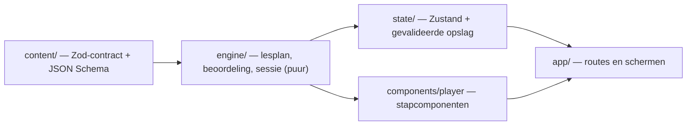

# pennig — van letter tot alinea

Leerapp voor Nederlands schrijven met Pim het potlood, opnieuw gebouwd in Next.js. Voor volwassenen die
Nederlands op moedertaalniveau lezen en verstaan, en de schrijftaal willen beheersen: van letter tot alinea.

Deze versie is **de interface en de oefenengine**. De lessen worden later apart uit PDF's gemaakt; de bestaande
lesinhoud draait ongewijzigd mee als referentie en testmateriaal. Voor "De letter", "Klank en letter", "De lettergreep",
"Het betekenisvolle woorddeel", "Het woord" en "De woordgroep" staan er al nieuwe lessen bij, tot masterniveau (zie [Eén inhoudsbron](#één-inhoudsbron)).

```bash
npm install
npm run dev          # http://localhost:3000
```

| Script                  | Wat het doet                                                              |
| ----------------------- | ------------------------------------------------------------------------- |
| `npm run dev`           | Ontwikkelserver                                                           |
| `npm run build`         | Productiebuild (alle lessen en voorbeelden statisch)                      |
| `npm run check`         | Typecheck, lint en unit-/componenttests                                   |
| `npm run test:e2e`      | Playwright op een productiebuild (desktop en mobiel)                      |
| `npm run content:check` | Valideert de lesinhoud tegen het contract                                 |
| `npm run content:schema`| Werkt het JSON Schema voor lesauteurs bij                                 |

Eerste keer e2e: `npx playwright install chromium`. Een draaiende server hergebruiken kan met
`E2E_BASE_URL=http://localhost:3000 npm run test:e2e`.

## Schermen

| Route                     | Scherm                                                                     |
| ------------------------- | -------------------------------------------------------------------------- |
| `/welkom/[stap]`          | Kennismaking (focus, tempo, startpunt); keuzes direct bewaard, terug werkt |
| `/`                       | Leren: Pim en de letterblokken van *boek* in 3D, "Verder met jouw les", de niveaus als 3D-toren met het groeiende voorbeeld, recente voortgang |
| `/lessen`                 | Bibliotheek: zoeken en filteren op niveau, vakgebied, status en oefenvorm (in de URL) |
| `/les/[lessonId]`         | Lesplayer; direct te openen, hervat na verversen                           |
| `/herhalen`, `/herhalen/sessie` | Opgeslagen oefenpunten en een herhaalronde (max. 8)                 |
| `/voortgang`              | Per niveau en vakgebied, oefentijd, laatst geoefend                        |
| `/instellingen`           | Geluid, rustige beweging, confetti, leerprofiel, export/import/wissen      |
| `/oefenvormen`            | Galerij van de nieuwe oefenvormen met voorbeeldinhoud (telt niet mee)      |

Laden, lege toestanden, ontbrekende lessen (404) en fouten hebben elk een eigen scherm.

## Versies

Gecontroleerd op onderlinge compatibiliteit (peer dependencies). TypeScript 6/7 en ESLint 10 zijn bewust nog niet
gebruikt: `typescript-eslint` en de React-/a11y-plugins van `eslint-config-next` ondersteunen die nog niet.

| Pakket | Versie | Functie |
| --- | --- | --- |
| next | 16.3.8 | App Router, statische lesroutes, `typedRoutes` |
| react, react-dom | 19.3.0 | UI |
| typescript | 5.9.3 | `strict` + `noUncheckedIndexedAccess` |
| @base-ui/react | 1.8.0 | Dialog/AlertDialog, Tabs, RadioGroup, ToggleGroup, Select, Switch, Slider, Progress, Collapsible, Field/Input, NavigationMenu, Toast, Tooltip |
| tailwindcss, @tailwindcss/postcss | 4.3.3 | Ontwerptokens in `src/app/globals.css` |
| motion | 14.0.0 | Stapovergangen, kaartjes naar hun plek, herschikken, voortgang, Pim |
| @dnd-kit/core | 6.3.1 | Slepen van oefenblokken (altijd met klik-/toetsenbordalternatief) |
| zustand | 5.0.15 | Instellingen, voortgang, sessieherstel (localStorage) |
| zod | 4.6.5 | Lescontract en validatie van opgeslagen gegevens |
| lucide-react | 1.52.0 | Iconen (naast eigen SVG voor Pim, niveaus en vakgebieden) |
| canvas-confetti | 1.9.4 | Kleine beloning, pas geladen bij gebruik |
| three, @types/three | 0.183.2, 0.183.1 | De 3D-voorwerpen (WebGL), pas geladen als er een 3D-onderdeel op de pagina staat |
| vitest / jsdom | 5.0.3 / 30.1.2 | Unit- en componenttests |
| @testing-library/react, user-event, jest-dom | 16.3.3, 14.6.7, 7.0.1 | Componenttests van oefenvormen |
| @playwright/test | 1.63.0 | End-to-end (onboarding, les, hervatten, toetsenbord, rustige beweging) |
| eslint, eslint-config-next | 9.39.5, 16.3.8 | Lint incl. React Compiler- en jsx-a11y-regels |

Geluid gebruikt Web Audio (geen bestanden); fonts komen via `next/font` (Fraunces, Bricolage Grotesque, Figtree).
Voorlezen (de knop "Luister" bij klanken) gebruikt de spraak van de browser (Web Speech API, `nl-NL`); zonder spraak
verdwijnt de knop.

## Architectuur

Inhoud, beoordeling, voortgang en presentatie zijn gescheiden:



- `src/content` — het **inhoudscontract** (`schema.ts`, `kinds.ts`): cursus → niveaus → lessen → stappen, met
  semantische controles (antwoord tussen de opties, indexen binnen de zin, oplosbare puzzels, …). Presentatie staat
  er alleen in als semantische accentnamen.
- `src/engine` — puur en serialiseerbaar: lesplan met stabiele stapsleutels, beoordeling per oefenvorm, en de
  sessie als toestandsmachine (`answering → feedback → done`; fout = later in de les nog eens).
- `src/state` — Zustand-stores. Opslag wordt bij laden met Zod gevalideerd; beschadigde gegevens krijgen een
  reservekopie en een melding. Sessies die niet meer bij de inhoud passen, vervallen netjes.
- `src/components/player` — de lesplayer en één component per oefenvorm (`step-view.tsx` is het register).
- `src/app` — routes; `(app)` met navigatie, `(focus)` zonder (kennismaking, lessen, herhaalronde, voorbeelden).

### Eén inhoudsbron

De app gebruikt **alleen** `src/content/catalog.ts`. Die laadt de 29 lessen uit `legacy/build.ts` (byte-gelijk aan
de bron) via `adapters/legacy.ts`, voegt de nieuwe lessen uit `packs/` toe en valideert alles met het contract.
`legacy/course.ts` bevat alleen de typen: de tweede cursus (`COURSE`) en `BOOKS` zijn bewust weggelaten, zodat er
geen tegenstrijdige inhoud naast elkaar bestaat.

`packs/` bevat 108 nieuwe lessen voor zes niveaus, achter de bestaande lessen van dat niveau (`withExtraLessons`):

| Bestand | Niveau | Lessen |
| --- | --- | --- |
| `packs/letter.ts` | De letter | 8 — basis: alfabet en woordenboekregels, ij en ei, accent, apostrof, trema en koppelteken · bachelor: afbreken, hoofdletters (eigennaam en soortnaam), schriftgeschiedenis van Proto-Sinaïtisch tot J, U en W, van kapitaal tot onderkast, spellingdiepte in twee richtingen |
| `packs/letter-master.ts` | De letter | 4 — master: grafeem en allograaf (vrije en positionele allografie), twee eeuwen spellinggeschiedenis, oogbewegingen en het tweerouteleesmodel, letterfrequentie en informatie |
| `packs/klank.ts` | Klank en letter | 15 — basis: foneem, articulatie, klinkerkaart, gespannen en ongespannen, tweeklanken, sjwa · bachelor: medeklinkertabel, allofonen, verscherping, assimilatie, ’t kofschip, epenthese en deletie, klemtoon, ij en ei, de vier spellingprincipes |
| `packs/klank-master.ts` | Klank en letter | 9 — master: kenmerken en natuurlijke klassen, sonoriteit, ambisyllabiciteit, klemtoon en lettergreepgewicht, regelordening, Optimaliteitstheorie (twee lessen), categoriale perceptie, klankverandering |
| `packs/klank-extra.ts` | Klank en letter | 3 — bachelor: variatie in de uitspraak (r, g, w, stemloos worden) · master: bron en filter, formanten en spectrogram, VOT · zinsaccent, focus en intonatie |
| `packs/greep.ts` | De lettergreep | 8 — bachelor: bewijs voor de lettergreep, onset-kern-coda, grenzen en fonotaxis, de rijm van drie plekken en de appendix, hiaat en glottisslag, schwa-epenthese, verkleinwoord en meervoud, lettergreepschriften |
| `packs/greep-master.ts` | De lettergreep | 6 — master: moras en het minimale woord, typologie en verwerving, ONSET en NOCODA in OT, het prosodische woord, ritmeklassen, de lettergreep in spraakproductie |
| `packs/greep-extra.ts` | De lettergreep | 1 — bachelor: rijm en metrum (eindrijm, alliteratie, assonantie, versvoeten, de alexandrijn) |
| `packs/deel.ts` | Het betekenisvolle woorddeel | 8 — bachelor: morfeem en allomorf, buiging tegenover afleiding, de rechterhoofdregel, woordbomen, samenstellingen, tussenklanken, eisen van affixen en blokkering, stamwisseling en suppletie |
| `packs/deel-master.ts` | Het betekenisvolle woorddeel | 6 — master: morfeem, proces of paradigma, inheemse en geleerde lagen met de haakjesparadox, productiviteit meten, prosodische morfologie, het mentale lexicon en de d/t-fout, woordvorming in beweging |
| `packs/deel-extra.ts` | Het betekenisvolle woorddeel | 1 — bachelor: afkappingen, letterwoorden en mengwoorden (woordvorming zonder morfemen) |
| `packs/nieuw/d21–d24.ts` | Het betekenisvolle woorddeel | 4 — bachelor: werkwoorden met be-, ver- en ont-, persoonsnamen (bakker, bakster, schilderes), aaneen, met streepje of los · master: waar morfologie en zinsbouw elkaar raken (synthetische samenstellingen, argumentvererving) |
| `packs/woord.ts` | Het woord | 8 — bachelor: lexeem, woordvorm en lemma, woordsoorten bewijzen, conversie en de naamwoordelijke infinitief, sterke en zwakke werkwoorden, geslacht en verwijzing, de buiging van het bijvoeglijk naamwoord, betekenisrelaties, polysemie en homonymie |
| `packs/woord-master.ts` | Het woord | 6 — master: valentie en thematische rollen, onaccusativiteit (hebben of zijn), prototypen tegenover kenmerken, collocaties, idioom en frames, de wet van Zipf en lexicale dichtheid, partikelwerkwoorden en klitieken |
| `packs/woord-extra.ts` | Het woord | 2 — bachelor: leenwoorden, uitvoer en volksetymologie · master: het mentale lexicon (frequentie, priming, puntje van de tong, het model van Levelt) |
| `packs/nieuw/w23–w26.ts` | Het woord | 4 — bachelor: werkwoordspelling bewezen (word, wordt, gebeurd), die, dat, wat en wie · master: de vier gezichten van er, tijd en aspect |
| `packs/onderzoek/` | Woorddeel en woord | Een derde uitlegronde (`onderzoek`) met zwaardere oefeningen achter elke les van beide niveaus; `withResearch` plakt die achter de bestaande stappen |
| `packs/groep.ts` | De woordgroep | 4 — bachelor: bewijs voor de woordgroep (constituenttests), kern en bepalingen, de naamwoordgroep van binnen, bijvoeglijke naamwoorden stapelen (volgorde en komma) |
| `packs/groep-bouw.ts` | De woordgroep | 4 — bachelor: de voorzetselgroep en R-woorden, complement of bepaling, de bijvoeglijke groep, lange bepalingen voor en na (naamwoordstijl, bijstelling, beperkende en uitbreidende bijzin) |
| `packs/groep-master.ts` | De woordgroep | 4 — bachelor: nevenschikking en samentrekking · master: X-bar-theorie, structurele ambiguïteit en tuinpadzinnen, de DP-hypothese |
| `packs/groep-theorie.ts` | De woordgroep | 4 — master: kwantoren en bereik, de betekenis van bijvoeglijke naamwoorden, woordgroep of samenstelling, zwaarte, volgorde en typologie |

Een les kan een `stage` hebben (`basis`, `bachelor` of `master`). Die verschijnt als label op de les en als
uitklapbare groep in de lijst van het niveau (alleen de stap met je volgende les staat open); lessen zonder `stage`
zien eruit als voorheen. De klanktabel staat één keer in
`packs/tables.ts` en wordt per les met een eigen opdracht gebruikt.

De demoset op `/oefenvormen` (`content/demo/`) is de voorbeeldinhoud uit "Interactieve lessen – ideeën", letterlijk
overgenomen. Die is geen cursusinhoud: losse sessies, niet bewaard, telt niet mee voor voortgang of herhaling.

## Lessen aansluiten

1. Maak een cursus als JSON volgens `content/schema/course-pack.schema.json` (editors geven dan aanvulling en
   foutmeldingen). Taalvoorbeelden in tekst markeer je met `*woord*`.
2. Geef stappen een vaste `id`. Voortgang en herhaalpunten hangen aan les-id + stap-id + een vingerafdruk van de
   inhoud; wijzigt een stap inhoudelijk, dan vervalt alleen het oude oefenpunt van die stap.
3. Vervang in `catalog.ts` `adaptLegacyCourse()` door de JSON-import. `CoursePackSchema.safeParse` blijft de poort.
4. `npm run content:check` — weigert onjuiste inhoud met een leesbare melding per veld.

Een PDF is een afzonderlijke bron: zet de uitgewerkte les eerst om naar dit contract; de app leest nooit direct
uit een PDF.

## Oefenvormen

Elke vorm werkt met aanraken, muis en toetsenbord; slepen heeft altijd een klik- of toetsalternatief.

| Modus | Vormen | Gedrag |
| --- | --- | --- |
| uitleg | uitleg (met klikexperiment, knippen, markeren, uitgang plakken, wisselen, alfabet, klinkerwiel, letters plakken, klinkerkaart, klanktabel, OT-tableau, sonoriteitsberg, lettergreepboom, woordboom (ook voor woordgroepen), paradigma, groepenjager, samenstelbank in 3D), nieuw begrip | Verder als de opdracht van een deel gedaan is |
| gecontroleerd | meerkeuze, combineren, invullen, woorden ordenen, alinea ordenen, sorteren, fout verbeteren, herschrijven, vrij schrijven (met taakeisen), Durf je?, dictee | Controleer → feedback blijft staan; fout komt later terug |
| zelfcontrolerend | swipe-kaarten, woordbouwer, tijdschuif, snelrondje (ook zonder klok), zinstrein, markeerstiften, voegwoord-duw, zinstang, verwijsdraad, betekenisladder, twee betekenissen, chat-scenario, toonregelaar, zegt en bedoelt, weegschaal, alinea-stapel, eindredactie | Rondt zichzelf af; fouten tellen in de score en komen op de herhaalstapel |

Een nieuwe vorm toevoegen: schema in `content/kinds.ts`, beoordeling in `engine/kinds.ts`, component in
`components/player/steps/extra/`, en één regel in `components/player/step-view.tsx`.

## Ontwerpsysteem

Tokens in `src/app/globals.css`: neutralen, accentsets per kleur (vlak, 3D-rand, AA-teksttint, zacht vlak, lijn,
tekst-op-vlak), tekstschaal, hoeken, tastbare plaatschaduwen en bewegingscurves. Een gebied kiest zijn accent met
`data-accent`. Overgangen duren meestal 160–280 ms; alleen verplaatsbare kaartjes veren licht. dnd-kit beweegt
alleen de sleepkopie, Motion de kaartjes zelf — nooit allebei hetzelfde element.

Rustige beweging volgt de systeemvoorkeur en een eigen, bewaarde instelling: geen verschuivingen, tellers of
confetti, en scrollen zonder animatie.

## 3D

De 3D-onderdelen zijn echte WebGL-scènes in de stijl van glanzend speelgoed: de welkomstscène op de startpagina, de
niveautoren, de samenstelbank (`compound` in het lescontract, nu in les d10) en de beloning na een les.

- `src/lib/toy3d/stage.ts` — het speelgoedtheater: studiolicht, zachte schaduw, glanslak, horizontaal slepen om te
  draaien (verticaal scrollen blijft werken), tikken met een raycaster. Shaders worden vooraf gebouwd (op de
  achtergrond waar de browser dat kan) en er wordt alleen getekend zolang er iets beweegt.
- `src/lib/toy3d/toy-canvas.tsx` — laadt three.js en een scène pas als het onderdeel op de pagina komt. Zonder
  WebGL, of met WebGL zonder grafische kaart (`support.ts`), staat er de gewone 2D-versie en wordt three.js niet
  gedownload. Met `localStorage['pennig:3d'] = 'altijd'` komt de 3D er toch (handig voor schermafbeeldingen).
- `src/lib/toy3d/scenes/` — één bestand per scène; rustige beweging zet alles stil behalve wat de leerling zelf doet.
- De voorwerpen staan in `public/models/dingen/` (GLB plus een WebP-icoon voor de knoppen) en in
  `src/content/things.ts`. Ze zijn gemaakt met [Meshy](https://docs.meshy.ai): eerst een plaatje in één vaste
  speelgoedstijl, dan een 3D-model uit dat plaatje. `scripts/meshy-dingen.mjs` doet dat en verkleint elk model
  (WebP-textures, gekwantiseerde punten). Een nieuw voorwerp: beschrijving in `DINGEN`, dan `plaatje`, `model` en
  `ophalen`, en een regel in `things.ts`.
- De les-iconen van Het betekenisvolle woorddeel en Het woord staan in `public/iconen/lessen/` en
  `src/content/lesson-icons.ts`; ze komen uit dezelfde Meshy-stijl (alleen het plaatje, `scripts/meshy-iconen.mjs`)
  en staan in de lessenlijst en bij het begin van de les. Een les zonder plaatje houdt zijn tekstteken.
