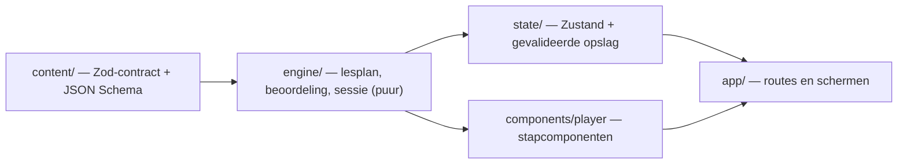

# pennig — van letter tot alinea

Leerapp voor Nederlands schrijven met Pim het potlood, opnieuw gebouwd in Next.js. Voor volwassenen die
Nederlands op moedertaalniveau lezen en verstaan, en de schrijftaal willen beheersen: van letter tot alinea.

Deze versie is **de interface en de oefenengine**. De lessen worden later apart uit PDF's gemaakt; de bestaande
lesinhoud draait ongewijzigd mee als referentie en testmateriaal. Voor "De letter" en "Klank en letter" staan er al
nieuwe lessen bij, van basis tot masterniveau (zie [Eén inhoudsbron](#één-inhoudsbron)).

```bash
npm install
npm run dev          # http://localhost:3000
```

| Script                  | Wat het doet                                                              |
| ----------------------- | ------------------------------------------------------------------------- |
| `npm run dev`           | Ontwikkelserver                                                           |
| `npm run build`         | Productiebuild (alle lessen en voorbeelden statisch)                      |
| `npm run check`         | Typecheck, lint en unit-/componenttests                                   |
| `npm run test:e2e`      | Playwright op een productiebuild (desktop en mobiel)                      |
| `npm run content:check` | Valideert de lesinhoud tegen het contract                                 |
| `npm run content:schema`| Werkt het JSON Schema voor lesauteurs bij                                 |

Eerste keer e2e: `npx playwright install chromium`. Een draaiende server hergebruiken kan met
`E2E_BASE_URL=http://localhost:3000 npm run test:e2e`.

## Schermen

| Route                     | Scherm                                                                     |
| ------------------------- | -------------------------------------------------------------------------- |
| `/welkom/[stap]`          | Kennismaking (focus, tempo, startpunt); keuzes direct bewaard, terug werkt |
| `/`                       | Leren: "Verder met jouw les", de niveaus met het groeiende voorbeeld, recente voortgang |
| `/lessen`                 | Bibliotheek: zoeken en filteren op niveau, vakgebied, status en oefenvorm (in de URL) |
| `/les/[lessonId]`         | Lesplayer; direct te openen, hervat na verversen                           |
| `/herhalen`, `/herhalen/sessie` | Opgeslagen oefenpunten en een herhaalronde (max. 8)                 |
| `/voortgang`              | Per niveau en vakgebied, oefentijd, laatst geoefend                        |
| `/instellingen`           | Geluid, rustige beweging, confetti, leerprofiel, export/import/wissen      |
| `/oefenvormen`            | Galerij van de nieuwe oefenvormen met voorbeeldinhoud (telt niet mee)      |

Laden, lege toestanden, ontbrekende lessen (404) en fouten hebben elk een eigen scherm.

## Versies

Gecontroleerd op onderlinge compatibiliteit (peer dependencies). TypeScript 6/7 en ESLint 10 zijn bewust nog niet
gebruikt: `typescript-eslint` en de React-/a11y-plugins van `eslint-config-next` ondersteunen die nog niet.

| Pakket | Versie | Functie |
| --- | --- | --- |
| next | 16.3.8 | App Router, statische lesroutes, `typedRoutes` |
| react, react-dom | 19.3.0 | UI |
| typescript | 5.9.3 | `strict` + `noUncheckedIndexedAccess` |
| @base-ui/react | 1.8.0 | Dialog/AlertDialog, Tabs, RadioGroup, ToggleGroup, Select, Switch, Slider, Progress, Collapsible, Field/Input, NavigationMenu, Toast, Tooltip |
| tailwindcss, @tailwindcss/postcss | 4.3.3 | Ontwerptokens in `src/app/globals.css` |
| motion | 14.0.0 | Stapovergangen, kaartjes naar hun plek, herschikken, voortgang, Pim |
| @dnd-kit/core | 6.3.1 | Slepen van oefenblokken (altijd met klik-/toetsenbordalternatief) |
| zustand | 5.0.15 | Instellingen, voortgang, sessieherstel (localStorage) |
| zod | 4.6.5 | Lescontract en validatie van opgeslagen gegevens |
| lucide-react | 1.52.0 | Iconen (naast eigen SVG voor Pim, niveaus en vakgebieden) |
| canvas-confetti | 1.9.4 | Kleine beloning, pas geladen bij gebruik |
| vitest / jsdom | 5.0.3 / 30.1.2 | Unit- en componenttests |
| @testing-library/react, user-event, jest-dom | 16.3.3, 14.6.7, 7.0.1 | Componenttests van oefenvormen |
| @playwright/test | 1.63.0 | End-to-end (onboarding, les, hervatten, toetsenbord, rustige beweging) |
| eslint, eslint-config-next | 9.39.5, 16.3.8 | Lint incl. React Compiler- en jsx-a11y-regels |

Geluid gebruikt Web Audio (geen bestanden); fonts komen via `next/font` (Fraunces, Bricolage Grotesque, Figtree).
Voorlezen (de knop "Luister" bij klanken) gebruikt de spraak van de browser (Web Speech API, `nl-NL`); zonder spraak
verdwijnt de knop.

## Architectuur

Inhoud, beoordeling, voortgang en presentatie zijn gescheiden:



- `src/content` — het **inhoudscontract** (`schema.ts`, `kinds.ts`): cursus → niveaus → lessen → stappen, met
  semantische controles (antwoord tussen de opties, indexen binnen de zin, oplosbare puzzels, …). Presentatie staat
  er alleen in als semantische accentnamen.
- `src/engine` — puur en serialiseerbaar: lesplan met stabiele stapsleutels, beoordeling per oefenvorm, en de
  sessie als toestandsmachine (`answering → feedback → done`; fout = later in de les nog eens).
- `src/state` — Zustand-stores. Opslag wordt bij laden met Zod gevalideerd; beschadigde gegevens krijgen een
  reservekopie en een melding. Sessies die niet meer bij de inhoud passen, vervallen netjes.
- `src/components/player` — de lesplayer en één component per oefenvorm (`step-view.tsx` is het register).
- `src/app` — routes; `(app)` met navigatie, `(focus)` zonder (kennismaking, lessen, herhaalronde, voorbeelden).

### Eén inhoudsbron

De app gebruikt **alleen** `src/content/catalog.ts`. Die laadt de 29 lessen uit `legacy/build.ts` (byte-gelijk aan
de bron) via `adapters/legacy.ts`, voegt de nieuwe lessen uit `packs/` toe en valideert alles met het contract.
`legacy/course.ts` bevat alleen de typen: de tweede cursus (`COURSE`) en `BOOKS` zijn bewust weggelaten, zodat er
geen tegenstrijdige inhoud naast elkaar bestaat.

`packs/` bevat 32 nieuwe lessen voor twee niveaus, achter de bestaande lessen van dat niveau (`withExtraLessons`):

| Bestand | Niveau | Lessen |
| --- | --- | --- |
| `packs/letter.ts` | De letter | 8 — basis: alfabet, ij, accenten en leestekens in woorden · bachelor: afbreken, schriftgeschiedenis, diepe en ondiepe spelling · master: grafeem en allograaf, spellinggeschiedenis |
| `packs/klank.ts` | Klank en letter | 15 — basis: foneem, articulatie, klinkerkaart, gespannen en ongespannen, tweeklanken, sjwa · bachelor: medeklinkertabel, allofonen, verscherping, assimilatie, ’t kofschip, epenthese en deletie, klemtoon, ij en ei, de vier spellingprincipes |
| `packs/klank-master.ts` | Klank en letter | 9 — master: kenmerken en natuurlijke klassen, sonoriteit, ambisyllabiciteit, klemtoon en lettergreepgewicht, regelordening, Optimaliteitstheorie (twee lessen), categoriale perceptie, klankverandering |

Een les kan een `stage` hebben (`basis`, `bachelor` of `master`). Die verschijnt als label op de les en als kopje
in de lijst van het niveau; lessen zonder `stage` zien eruit als voorheen. De klanktabel staat één keer in
`packs/tables.ts` en wordt per les met een eigen opdracht gebruikt.

De demoset op `/oefenvormen` (`content/demo/`) is de voorbeeldinhoud uit "Interactieve lessen – ideeën", letterlijk
overgenomen. Die is geen cursusinhoud: losse sessies, niet bewaard, telt niet mee voor voortgang of herhaling.

## Lessen aansluiten

1. Maak een cursus als JSON volgens `content/schema/course-pack.schema.json` (editors geven dan aanvulling en
   foutmeldingen). Taalvoorbeelden in tekst markeer je met `*woord*`.
2. Geef stappen een vaste `id`. Voortgang en herhaalpunten hangen aan les-id + stap-id + een vingerafdruk van de
   inhoud; wijzigt een stap inhoudelijk, dan vervalt alleen het oude oefenpunt van die stap.
3. Vervang in `catalog.ts` `adaptLegacyCourse()` door de JSON-import. `CoursePackSchema.safeParse` blijft de poort.
4. `npm run content:check` — weigert onjuiste inhoud met een leesbare melding per veld.

Een PDF is een afzonderlijke bron: zet de uitgewerkte les eerst om naar dit contract; de app leest nooit direct
uit een PDF.

## Oefenvormen

Elke vorm werkt met aanraken, muis en toetsenbord; slepen heeft altijd een klik- of toetsalternatief.

| Modus | Vormen | Gedrag |
| --- | --- | --- |
| uitleg | uitleg (met klikexperiment, knippen, markeren, uitgang plakken, wisselen, alfabet, klinkerwiel, letters plakken, klinkerkaart, klanktabel, OT-tableau), nieuw begrip | Verder als de opdracht van een deel gedaan is |
| gecontroleerd | meerkeuze, combineren, invullen, woorden ordenen, alinea ordenen, sorteren, fout verbeteren, herschrijven, vrij schrijven (met taakeisen), Durf je?, dictee | Controleer → feedback blijft staan; fout komt later terug |
| zelfcontrolerend | swipe-kaarten, woordbouwer, tijdschuif, snelrondje (ook zonder klok), zinstrein, markeerstiften, voegwoord-duw, zinstang, verwijsdraad, betekenisladder, twee betekenissen, chat-scenario, toonregelaar, zegt en bedoelt, weegschaal, alinea-stapel, eindredactie | Rondt zichzelf af; fouten tellen in de score en komen op de herhaalstapel |

Een nieuwe vorm toevoegen: schema in `content/kinds.ts`, beoordeling in `engine/kinds.ts`, component in
`components/player/steps/extra/`, en één regel in `components/player/step-view.tsx`.

## Ontwerpsysteem

Tokens in `src/app/globals.css`: neutralen, accentsets per kleur (vlak, 3D-rand, AA-teksttint, zacht vlak, lijn,
tekst-op-vlak), tekstschaal, hoeken, tastbare plaatschaduwen en bewegingscurves. Een gebied kiest zijn accent met
`data-accent`. Overgangen duren meestal 160–280 ms; alleen verplaatsbare kaartjes veren licht. dnd-kit beweegt
alleen de sleepkopie, Motion de kaartjes zelf — nooit allebei hetzelfde element.

Rustige beweging volgt de systeemvoorkeur en een eigen, bewaarde instelling: geen verschuivingen, tellers of
confetti, en scrollen zonder animatie.
